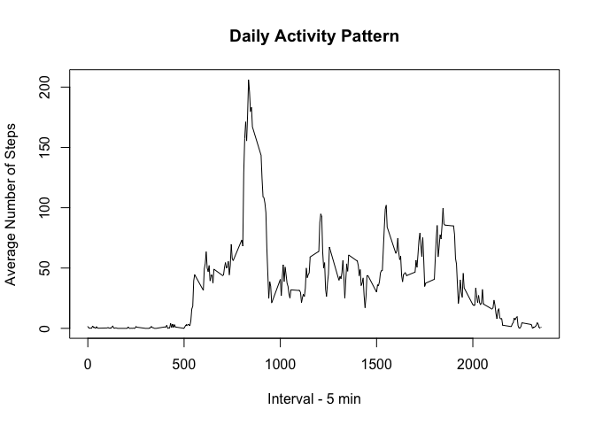

Thank you for taking the time to review this assignment prepared for the Reproducible research course on Coursera.  Below you will find my code and output

## Loading and preprocessing the data

This first step was to load and process the data.  This included converting the "date" varialbe to the proper format.  A histogram was also produced showing the frequency of the number of steps taken per day.


```r
unzip("activity.zip")
active <- read.csv("activity.csv")
active$date <- as.Date(active$date, "%Y-%m-%d")

tot.steps <- with(active, tapply(steps, date, sum, na.rm = TRUE))
hist(tot.steps, main = "Steps Per Day", xlab = "Number of Steps")
```

<!-- -->


## What is mean total number of steps taken per day?

Next, I calculated the mean and median number of steps taken per day.

```r
mean(tot.steps)
```

```
## [1] 9354.23
```

```r
median(tot.steps)
```

```
## [1] 10395
```
The mean number of steps taken each day was 9354.2295082, and the median number of steps was 10395 

## What is the average daily activity pattern?

Next, I examined the average daily activity pattern.

```r
stepsInterval <- aggregate(steps ~ interval, active, mean)
plot(stepsInterval$interval, stepsInterval$steps, type="l", xlab = "Interval - 5 min", 
     ylab = "Average Number of Steps", main = "Daily Activity Pattern")
```

<!-- -->


## Imputing missing values
Next, we replaced missing values and ran subsequent analyses.  First, I calculated the number of missing values in the dataset. Next, Missing values were replaced with zeros. Below is a new histogram of the total number of steps taken with the missing values changed to zero.


```r
nrow(active[is.na(active$steps), ])
```

```
## [1] 2304
```

```r
new.active <- active
new.active[is.na(new.active), "steps"] <- 0
noNA_totsteps <- aggregate(steps ~ date, new.active, sum)
hist(noNA_totsteps$steps, main = "Steps Per Day", xlab = "Number of Steps")
```

<!-- -->

I also calculated the mean and the median of the number of steps taken with the new data with the NAs replaced


```r
mean(noNA_totsteps$steps)
```

```
## [1] 9354.23
```

```r
median(noNA_totsteps$steps)
```

```
## [1] 10395
```

The new mean with the NAs replaced was 9354.2295082, and the new median was 1.0395\times 10^{4}.

## Are there differences in activity patterns between weekdays and weekends?

Lastly, I examined activity patterns between weekdays and weekends.  This first required reformatting the data in order to complete the analysis.

```r
library(dplyr)
```

```
## 
## Attaching package: 'dplyr'
```

```
## The following objects are masked from 'package:stats':
## 
##     filter, lag
```

```
## The following objects are masked from 'package:base':
## 
##     intersect, setdiff, setequal, union
```

```r
new.active <- mutate(new.active, day = weekdays(new.active$date))
weekdays <- c('Monday', 'Tuesday', 'Wednesday', 'Thursday', 'Friday')
new.active$day <- factor((weekdays(new.active$date) %in% weekdays), 
                       levels=c(FALSE, TRUE), labels=c('Weekend', 'Weekday'))
weekdays <- subset(new.active, day == "Weekday")
weekends <- subset(new.active, day == "Weekend")
active.Weekdays <- aggregate(steps ~ interval, weekdays, mean)
active.Weekends <- aggregate(steps ~ interval, weekends, mean)
```

The graphs produced below highlight the difference in activity between weekdays and weekend days.


```r
par(mfrow = c(2, 1))
plot(active.Weekdays, type = "l", col = "green", main = "Weekdays")
plot(active.Weekends, type = "l", col = "red", main = "Weekends")
```

<!-- -->
